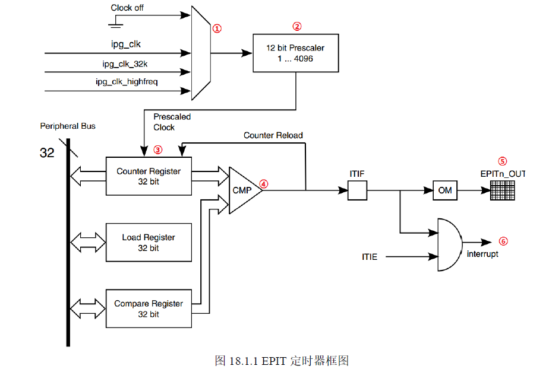
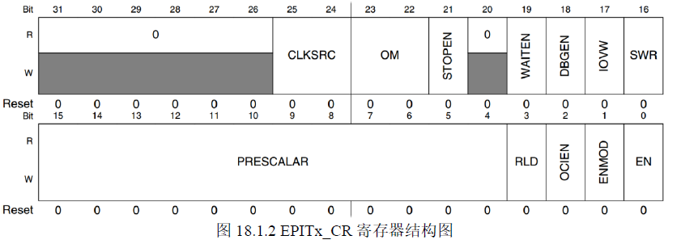
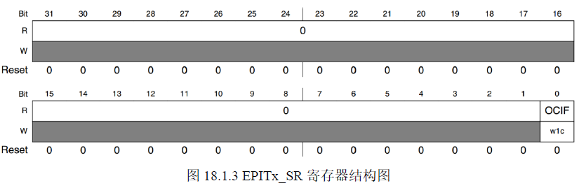

# EPIO（Enhanced Periodic Interrupt Timer）
## 一、EPIT 简介
> 1. EPIT 是32位的一个向下计数器
> 2. EPIT 的时钟源可以选择，我们选择ipg_clk = 66 Mhz
> 3. 可以对时钟源进行分频，12位的分频器， 0~4095 分别代表 1~4096 分频。
> 4. 开启定时器后，计数寄存器回每个始终减1，如果和比较寄存器里面的值相等的话就会触发中断

## EPIT 有俩个工作模式
> 1. Set-add-forget模式 EPITx_CR(x=1 2)寄存器的 RLD 位置 1的时候 EPIT 工作在此模式下，在此模式下 EPIT 的计数器从加载寄存器EPITx_LR 中获取初始值，不能直接向计数器寄存器写入数据。不管什么时候，只要计数器计数到 0，那么就会从加载寄存器 EPITx_LR 中重新加载数据到计数器中，周而复始。
> 2. free-running模式 EPITx_CR寄存器的 RLD位清零的时候 EPIT工作在此模式下，当计数器计数到 0以后会重新从 0XFFFFFFFF 开始计数，并不是从加载寄存器 EPITx_LR 中获取数据。
## imx6ull 有2个 EPIT 定时器
> EPIT_CR寄存器 用于配置

## 二、实验原理
> 
>1.EPIT_CR bit[0] 为 1, 设置 EPIT 使能, bit[1] 为1,设置计数器的初始值为记载寄存器的值. bit[2] 使能比较中断, bit[3] 为1设置定时器工作在 set-and-forget模式下.bit[15:4] 设置分频值。bit[25:24]设置时钟源的选择，我们设置为 1，那么 EPIT 的时钟源就是 ipg_clk = 66 Mhz

> 2. EPIT_SR 只有 bit[0] 有效， 表示中断状态，写 1 清除中断状态.当 OCIF 位为 1 时，表示中断发生，为 0 的时候表示中断未发生，我们可以在中断服务函数中清除中断状态，来避免重复触发中断。
> 3. EPIT_LR 寄存器设置计数器的加载器。计数器每次计时器到0以后就会读取LR寄存器的值重新开始计时。
> 4. CMPR 比较计数器，当计数器的和 CMPR 寄存器的值相等的话就会触发中断。
> 5. 使用 EPIT 实现 500ms 周期的定时器。我们在 EPIT 中断服务函数里，每触发一次中断，就让 LED 灯亮灭。
## 三、实验程序编写
> 分频系数 和 加载值 的关系
> $Tout = ((frac + 1) * value) / ipg_clk$
> ipg_clk: 是EPIT 的时钟源，我们选择 ipg_clk = 66 Mhz
> Tout: 是 EPIT 的输入时钟频率。
> frac: 是分频系数， 0~4095 分别代表 1~4096 分频。
> value: 是加载值， 0~0xFFFFFFFF 分别代表 1~4294967296。
> 1. 500ms 周期的定时器
> $frac = 0$ 不分频    $value = 33000000$
> 500ms = 66000000/2 = 33000000 = 0x80000000 = LR 寄存器的值

### 1、设置 EPIT1的时钟源
设置寄存器 EPIT1_CR寄存器的 CLKSRC(bit25:24)位，选择 EPIT1的时钟源。
### 2、设置分频值
设置寄存器 EPIT1_CR寄存器的 PRESCALAR(bit15:4)位，设置分频值。
### 3、设置工作模式
设置寄存器 EPIT1_CR的 RLD(bit3)位，设置 EPTI1的工作模式。
### 4、设置计数器的初始值来源
设置寄存器 EPIT1_CR的 ENMOD(bit1)位， 设置 计数器的初始值 来源 。
### 5、 使能 比较中断
我们要使用到比较中断，因此需要设置寄存器 EPIT1_CR的 OCIEN(bit2)位，使能比较中
断。
### 6、设置加载值和比较值
设置寄存器 EPIT1_LR中的加载值和寄存器 EPIT1_CMPR中的比较值，通过这两个寄存器
就可以决定定时器的中断周期。
### 7、 EPIT1中断设置和中断服务函数编写
使能 GIC中对应的 EPIT1中断，注册中断服务函数，如果需要的话还可以设置中断优先
级。最后编写中断服务函数。
### 8、使能 EPIT1定时器
配置好 EPIT1以后就可以使能 EPIT1了，通过寄存器 EPIT1_CR的 EN(bit0)位来设置。
通过以上几步我们就配置好 EPIT了，通过 EPIT的比较中断来实现 LED0的翻转。