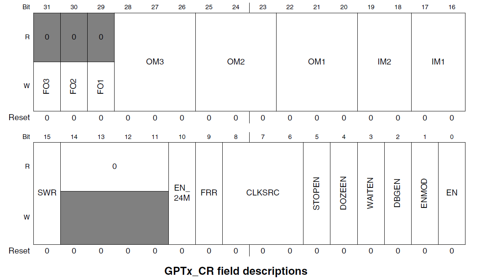
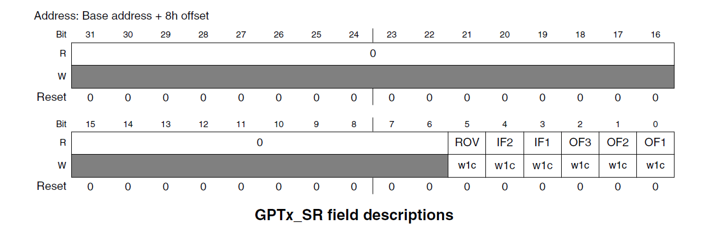
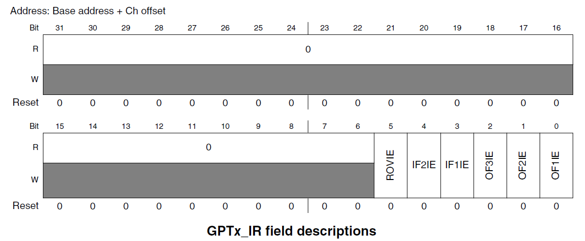

# 高精度延时
## 一、GPT（General Purpose Timer）定时器简介
> 以前的延时函数就采用空指令执行来实现，延时肯定不准确！当我们修改了imx6ull的系统主频以后，延时函数的精度也会受到影响。因此我们需要一个高精度的延时函数。而且不随着主频变化而改变
> STM32 使用 SYSTICK 这个硬件定时器来实现高精度延延时。因此我们可以在imx6ull中 使用一个硬件定时器来实现高精度延时。
> 本次来使用另一个定时器来实现高精度延迟。
> GPT 定时器是 32 为向上计数定时器。
> GPT 定时器可以捕获外部信号的上升沿和下降沿。
> GPT 定时器可以产生比较输出和中断。
> GPT 定时器有一个12位的分频器。
> GPT 的时钟源可以选择，这里使用ipg_clk=66MHz 作为时钟源。
> GPT 定时器有2种工作模式：restart 和 free-run
restart 模式：定时器计数值和比较寄存器 OCR 的值相等的话定时器就会从0开始计时。注意！只有比较通道1才有此功能。
free-run 模式：所有3个输出比较通道都适用。从0~0xFFFFFFFF递增，然后从0开始，周而复始。

GPT_CR 寄存器，bit[0] 为GPT 使能位，为 0 的时候关闭GPT，为1的时候使能GPT。bit[1] 确定GPT定时器计数器的初始值，为 0 的时候表示GPT定时器计数器默认为上次关闭时遗留的值，为 1 时计数器值为0。bit[8:6] 为时钟源的选择。设置为 1，表示GPT时钟源设置为ipg_clk = 66MHz。bit[9] 设置GPT定时器工作模式，为 0 的时候工作在 restart 模式，为 1 时 公仔free-run 模式。bit[15] 为软件复位。bit[11:0] 为分频值0~4095，可设置1~4096。

GPT_SR 寄存器，bit[5]表示溢出发生，bit[4] 为输入通道2的捕获中断标志位，bit[3] 为输入通道1的捕获中断标志位，bit[2:0] 也就是OF3~1为比较中断。

GPT_IR 寄存器，也就是中断使能寄存器。
## 二、GPT 定时器使用
> 1us => 1个数就是1us 
> 100us = 读CNT寄存器的值为100即可
> 1ms = 1000us = 读CNT寄存器的值为1000即可