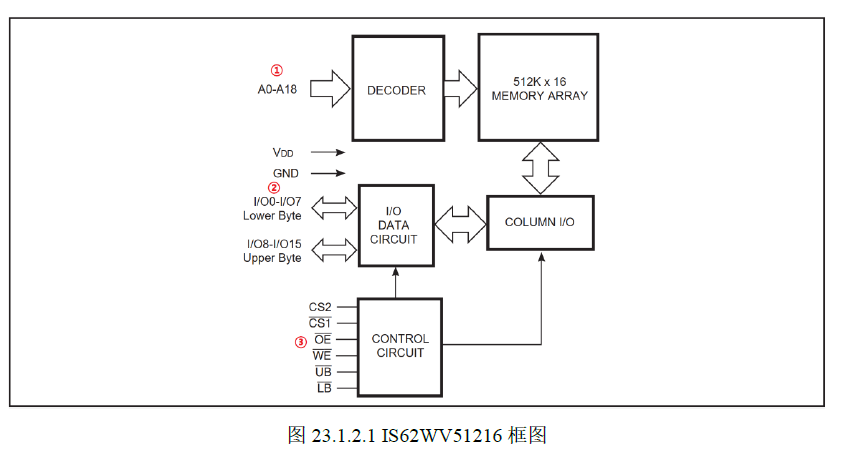
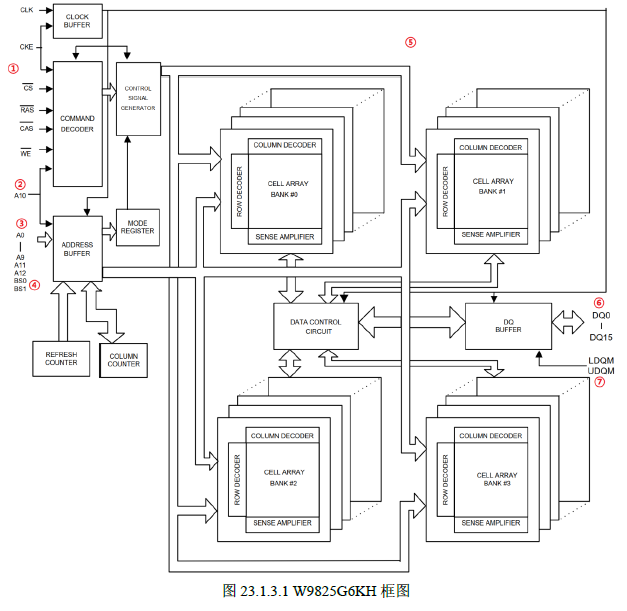
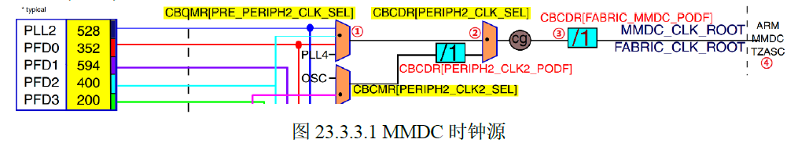
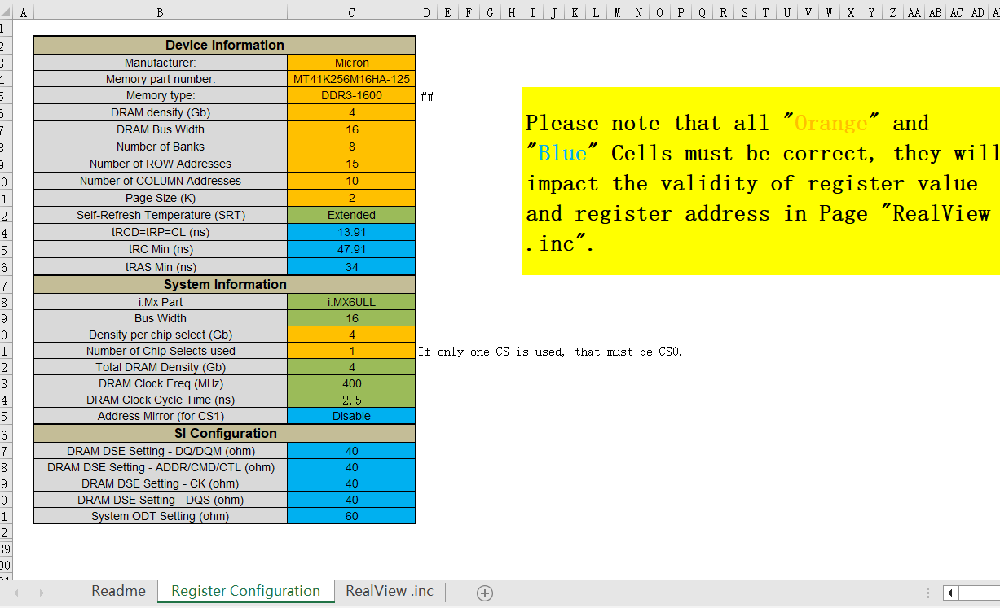

# DDR
## 一、DDR 简介
### 1. RAM 和 ROM 的区别
> RAM (Random Access Memory)是随机访问内存器。
> ROM (Read Only Memory)是只读内存器。Flash 是一种 ROM。
> Flash 是一种非易失性存储器，它可以在不断电的情况下保持数据。
> Flash 可以通过编程来写入数据。

### 2. SRAM
> SRAM (Static Random Access Memory)是静态随机访问内存器。成本高 速度快。
>一开始是芯片内部的RAM，后面因为应用需要外扩RAM，比如STM32F103/F407 开发 外扩 1MB SRAM。
> IS62WV51216 这是一个16位宽的1MB的SRAM。

2^19 = 524488 =512K x 2 字节
> 1. bit（比特 / 位）一位二进制数
> 2. B（Byte / 字节）1 B = 8 b
> 3. KB（千字节）1 KB = 1024 B
> 4. MB（兆字节）1 MB = 1024 KB
> 5. GB（吉字节）1 GB = 1024 MB
> 6. TB（太字节）1 TB = 1024 GB
> $1 TB = 1024 GB = 1024 × 1024 MB = 1024 × 1024 × 1024 KB = 1024 × 1024 × 1024 × 1024 B = 1024 × 1024 × 1024 × 1024 × 8 b$
### 3. SDRAM
> SDRAM (Synchronous Dynamic Random Access Memory)是同步动态随机访问内存器。成本低 速度慢。
> SDRAM 需要时钟线，常见的就是100Mhz/133Mhz/166Mhz/200Mhz。

## 三、DDR 时间参数
### 1. 传输速率
>  DDR3 1600、 DDR3 1866、 DDR4 2400、DDR4 3200MT/s
### 2. tRCD
> 
### 3. CL 参数
>
### 4. tRC 参数
>
### 4. TRAS 参数
>
## 三、 I.MX6U MMDC 控制器
> 1. 多模支持 DDR3/DDR3L LPDDR2*16
> 2. MMDC 最高支持 DDR3 频率是 400MHz 800MT/S
> 3. MMDC 提供的 DDR3 连接信号。6ULL 给 DDR 提供了专用的IO
> 4. 时钟树 

> DDR 使用的时钟源为 MMDC_CLK_ROOT = PLL2_PFD2 = 396MHz。在前面例程已经设置为 396MHz
> CBCMR 寄存器的PRE_PERIPH2_CLK_SE 来选择，也就是bit[22:21]，设置pre_periph2时钟源，设置为[01]，也就是PLL2_PFD作为pre_periph2时钟源.
> CBCDR 寄存器的 PERIPH2_CLK_SEL位，也就是bit[26],设置为0，PLL2作为MMDR时钟源，396MHz。
> CBCDR 寄存器的 PABIC_MMDC_PODF 位，bit[5:3],设置为0，也就是 1 分频。最终MMDC_CLK_ROOT = 396MHz。
## 四、DDR3L 初始化 与 测试
### 1. ddr_stress_tester 配置文件
> excel 配置文件,excel 配置号以后 RealView.inc会同步更新。

### 2. inc文件
> ddr_stress_tester.exe 工具需要用这个.inc文件。
### 3. 测试
> ddr_stress_tester.exe 工具通过USB 口将inc 中的配置下载到开发板里。
### 4. 做校准
> 