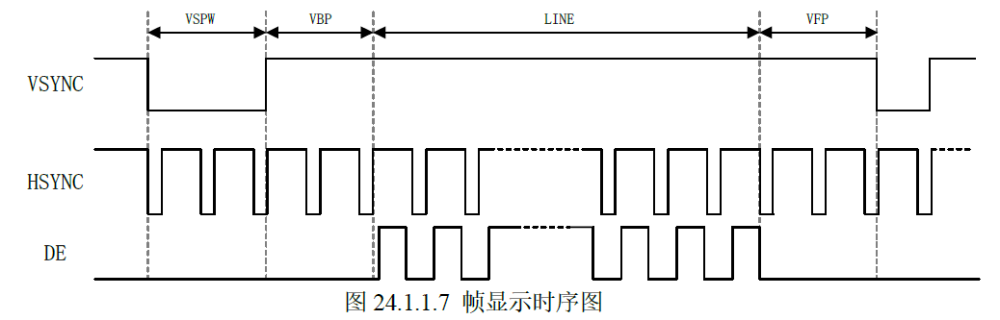
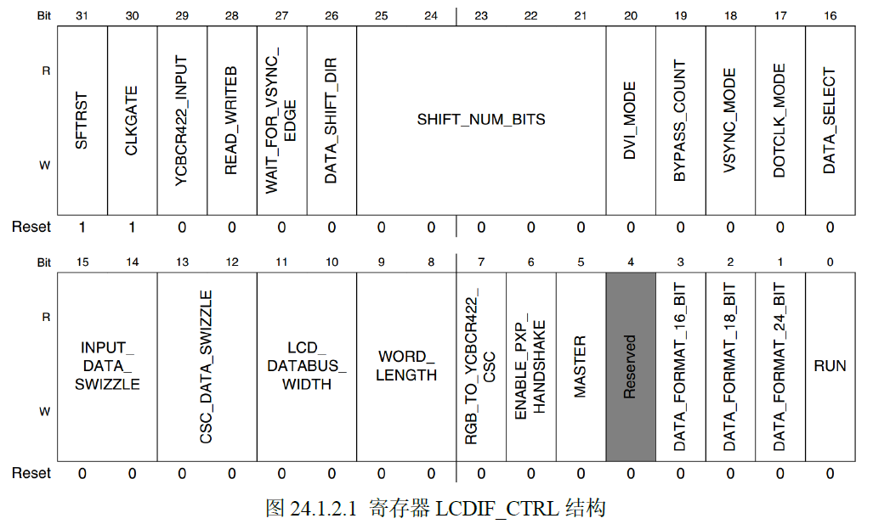
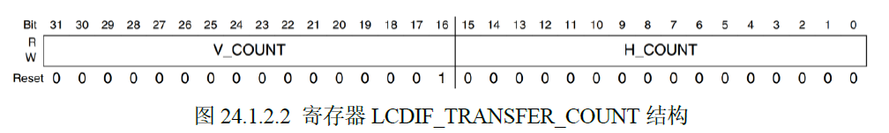
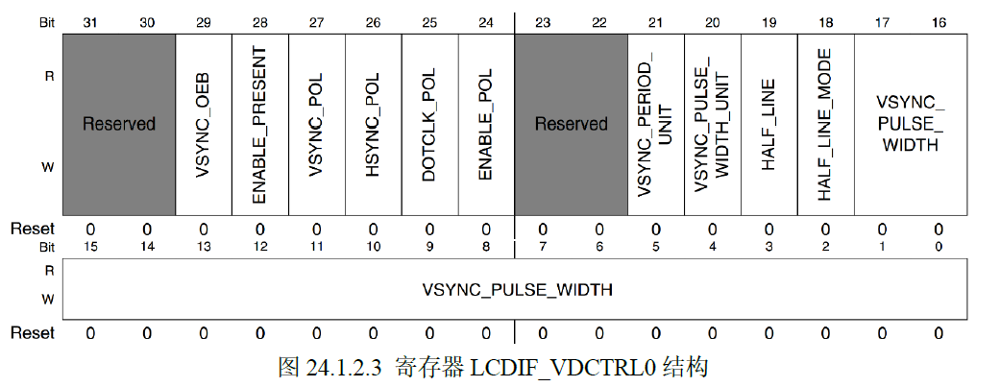
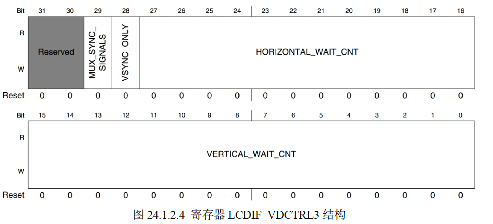
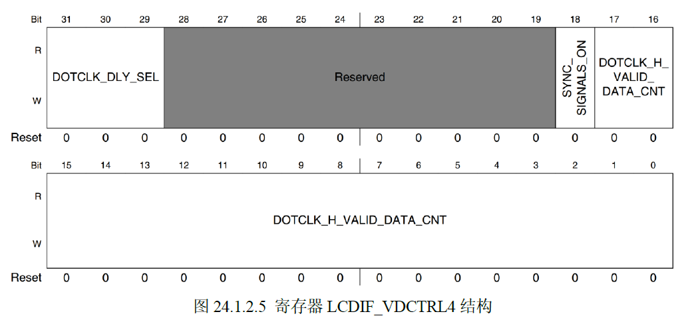
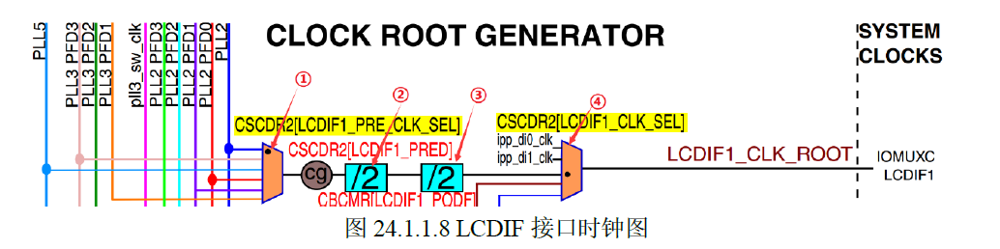

# RGB LCD （Liquid Crystal Display）
## 一、RGBLCD 显示原理简介
### 1. 像素点
> 像素点是 LCD 显示的基本单位，每个像素点都有自己的颜色。像素点像一个“小灯”，不管是液晶屏，还是手机、平板、RGBLCD屏幕，都是由一个一个的彩色小灯构成，彩色点阵屏幕每个像素点有三个小灯，分别对应红、绿、蓝三色。也叫RGB，RGB是光的三种原色。
### 2. 分辨率
> 1. 要想显示文字，图片、视频等，需要有很多像素点，分辨率就是像素点的个数，单位是像素。1080P 就是 1920x1080 像素，表示一行有1920个像素点，一列有1080个像素点。2K 就是 2560x1440 像素。4K 就是 4096x2160 像素。同样，显示器也有一个尺寸 24寸、27寸和32寸，单位是英寸，一寸是3.3cm，是显示器的对角长度，尺寸固定，像素越高显示效果越精细。
> 2. 正点原子的RGB的屏幕有：4.3寸480x272,800x480、7寸800x480和1024x600、10寸的1280x800。
> 3. PPI：iPhone4 屏幕尺寸是3.5寸，像素960x640，PPI是$327 = sqr（960^2 + 640^2）/3.5$
### 3. 像素格式
> 1. 如何将RGB 三种颜色来进行量化，每种bit 就是 2^24 = 16777216 = 1677万种颜色。HDR10 ，支持HDR效果的10bit面板，RGB 就需要30bit 来表示。
> 2. 在RGB888的基础上在加上 8 bit 透明度，就变成了RGB8888。
### 4. LCD 屏幕接口
> 1. RGB 格式屏幕，一般叫做 RGB 接口屏幕
> 2. 屏幕接口有：MIPI、HDMI、DisplayPort、DVI、VGA、RGB 等。
> 3. 正点原子屏幕ID 可以识别出不同的屏幕，在 RGBLCD 屏幕上对 R7、G7、B7 焊接上拉或者下拉电阻来实现不同的ID.
> 4. 正点原子的ALPHA 底板 RGB 屏幕接口用了 3 个 3157 模块模拟开关，原因是防止 LCD 屏幕上的 ID 电阻影响到6ULL的启动。
### 5. LCD 的时间参数
>- 1. 帧率：每秒显示多少帧，单位是帧/秒。
>- 2. 帧间隔：每帧之间的间隔，单位是秒。
>- 3. 帧时间：每帧的显示时间，单位是秒。
>- 4. 帧时间间隔：每帧之间的间隔，单位是秒。
> #### 水平：HSYNC
>
> 1. 水平：HSYNC，是水平同步信号，也叫做行同步信号，用于同步显示设备的水平扫描。当出现 HSYNC 信号时，表示新的一行开始显示。
> 2. 产生 HSYNC 信号的时间，表示性的一行开始显示，HSYNC 信号得维持一段时间，这段时间叫做HSPW。
> 3. HSYNC 信号完成以后，需要一段时间延时，这段时间叫做HBP。
> 4. 显示1024个像素点数据，需要1024个CLk
> 5. 一行像素显示完成后，需要一段时间延迟，这段时间叫做HFP。
> 6. 因此真正需要显示一行像素点的时间是：1024 + HSPW + HBP + HFP
>#### 垂直：VSYNC
>
> 1. 垂直：VSYNC，是垂直同步信号，也叫帧同步信号，用于同步显示设备的垂直扫描。当出现 VSYNC 信号时，表示新的一帧开始显示。
> 2. VSYNC 信号持续一段时间，这段时间叫做VSPW。
> 3. VSYNC 信号完成以后，需要一段时间延时，这段时间叫做VBP。
> 4. VBP 信号结束以后就是需要显示的行数，比如1080P 就是 1080 行。
> 5. 所有的行显示完成一行，一段延迟，这段时间叫做VFP。
> 6. 因此真正需要显示一帧像素点的时间是：1080 + VSPW + VBP + VFP
> 总时间 = 帧率 * 帧间隔 + 帧时间
> 7. 总时间是：(1080 + VSPW + VBP + VFP) * (1024 + HSPW + HBP + HFP)
### 6. 显存
> 显存：显示存储空间，采用 ARG8888 = 32bit = 4B。这4个字节的数据表示一个像素点的信息，必须得存起来，1024x600x4 = 2.5MB 的内存给 LCD用。方法很简单，直接定义一个32位的数组，u32 screen[1024x600]; 就可以了。
## 二、IMX6ULL LCDIF 控制器接口原理
> 1. 我们使用 DOTCLK 接口，也就是 VSYNC、HSYNC、ENABLE(DE) 和 DOTCLK(PCLK)

> 2. LCDIF_CTRL 寄存器，bit[0] 必须置1，bit[1] 设置数据格式24位全部有效，bit[5] 设置 LCDIF 工作在主机模式下，必须要置1，bit[9:8] 设置输入像素格式为24bit，写3[11]。bit[11:10] 设置数据传输宽度为24bit，写3[11]。bit[13:12] 设置数据传输高度为24bit，写3[11]。bit[15:14] 设置输入数据交换，不交换设置[0]。bit[17] 置 [1] ，LCDIF 工作在 DOTCLK 模式下。bit[19] 必须置[1]因为工作中DOTCLK模式下。bit[31] 是复位功能，必须设置为[0]。
> 3. LCDIF_CTRL1 寄存器的bit[19:16] 要设置0x7。24位格式。

> 4. LCDIF_TRANSFER_COUNT 寄存器的bit[15:0] 是LCD一行的像素点数，写1024。bit[31:16] 是LCD一共多少行，写600行。

> 5. LCDIF_VDCTRL0 寄存器，bit[17:0] 是垂直同步信号的时间，写VSPW。bit[20] 设置vsync信号宽度单位，要设置为[1]。bit[21] 设置为[1]。bit[24] 设置ENABLE信号极性，为[0]的时候是低电平，为[1]的时候是高电平。bit[25] 是时钟信号，要设置为[0]。bit[26] 是设置HSYNC信号极性，为[0]的时候是低电平，为[1]的时候是高电平。bit[27] 设置VSYNC 信号极性，设置为[0]，低电平有效。bit[28] 设置[1]，开始ENABLE信号。bit[29] 设置为[0]，VSYNC输出。
> 6. LCDIF_VDCTRL1 寄存器为2个VSYNC 信号之间的长度，那就是 VSPW + HEIGHT + VFPD + VBP。
> 7. LCDIF_VDCTRL2 寄存器,bit[17:0] 是2个HSYNC 信号之间的长度，那就是 HSPW + HBP + HFP。

> 8. LCDIF_VDCTRL3 寄存器,bit[15:0] 是VBP + VSPW。bit[27:16] 是VBP + HSPW。

> 9. LCDIF_VDCTRL4 寄存器, bit[17:0] 是一行有多少像素点，一行1024个像素点。bit[18]设置为1。
> 10. LCDIF_CUR_BUF,LCD 当前缓存，写显存数组的首地址。
> 11. LCDIF_NEXT_BUF,LCD 下一个帧数据的收地租，写显存数组的首地址。
> 12. LCD IO 初始化。
### 三、LCD 像素时钟设置
> LCD 需要一个CLK信号，这个时钟信号是IMX6ULL的 CLK 引脚发送给RGBLCD的，比如7寸1024x600的屏幕需要512MHz的CLK。

> LCD_CLK_ROOT 就是IMX6ULL的像素时钟，我们设置PLL5为(video PLL)为LCD的时钟源。
> $ PLL5 = Fre*(DIV_SELECT + NUM/DENOM)$
> DIV_SELECT就是CMM_ANALOG_PLL_VIDEO的bit[6:0]也就是DIV_SELEC位，可选范围27~54。设置PLL_VIDEO 寄存器的bit[20:19] 为2，表示为1分频 设置CCM_ANALOG_MISC2n寄存器的bit[31:30]为0，1分频。我们不使用小数分频器，因此设置CCM_ANALOG_PLL_VIDEO_DENOM = 0。
> CCM_CSCDR2 寄存器的bit[17:15]，设置LCDIF_PRE_CLK_SEL，选择LCDIF_CLK_ROOT的时钟源，设置为0x2，表示LCDIF时钟源为PLL5。bit[14:12]为LCDIF_PRED位，设置前级分频，可以设置0-7，分别对应1~8分频。
> CCM_CBCMR寄存器的bit[25:23] 为LCDIF_PODF，设置为2级分频，可以设置为0~7，分别对应1~8分频。
> CCM_CBCMR2寄存器，bit[11:9]为LCDIF_CLK_SEL，选择LCD_CLK的最终时钟源，设置为0。
## 四、LCD 驱动程序编写
> 1. 如果使用的正点原子的开发板和RGB屏幕，那么在驱动LCD之前，需要读取屏幕ID