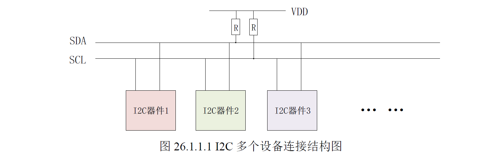
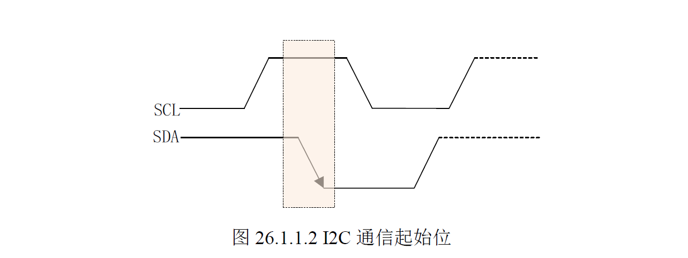
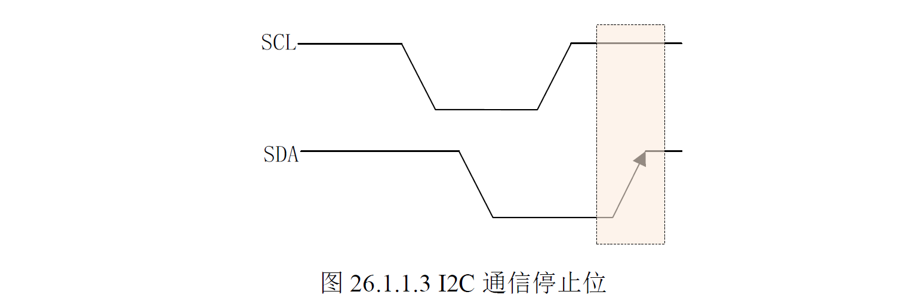
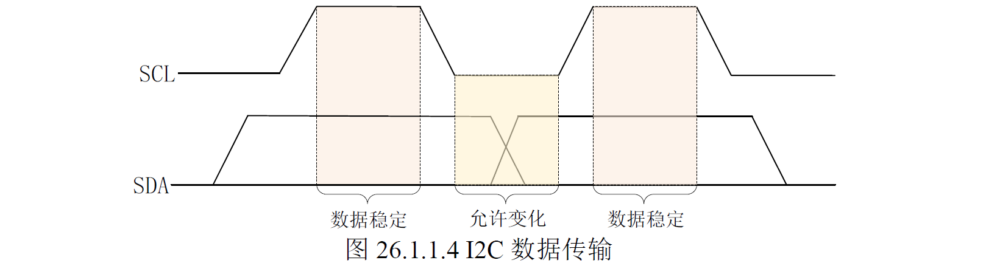
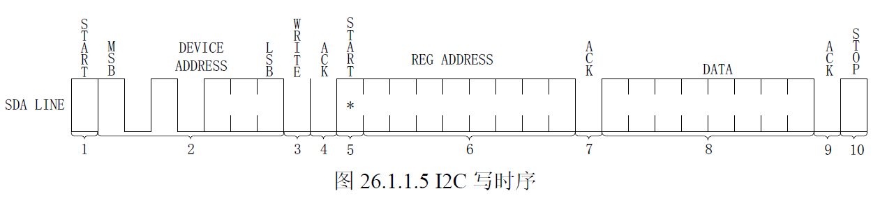
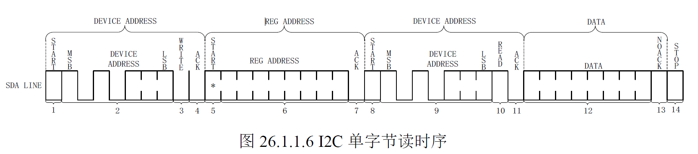
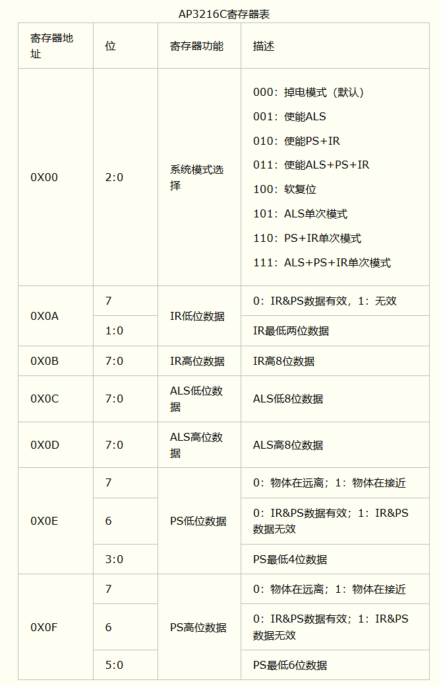

# IIC/I2C (Inter-Integrated Circuit)
## 一、IIC/I2C 协议详解
> 1. ALPHA 开发板上有一个 AP3216C，这是一个 I2C 接口设备，是一个环境光传感器。AP3216C 连接到了 I2C1 总线上面。
> 2. I2C_SCL 使用的是 UART4_TXD 这个IO，复用为ALT2。
> 3. I2C_SDA 使用的是 UART4_RXD 这个IO，复用为ALT2。

> 1. I2C SDA 是 I2C 总线上的数据线，用于传输数据。I2C SCL 是 I2C 总线上的时钟线，用于同步数据的传输。这 2 根总线必须要接上拉电阻一般为4.7kΩ。
### 2、I2C 协议流程
> 1. 起始位, 是 I2C 协议的第一个位，用于标识一个新数据的开始。当SCL为高电平时，SDA 出现下降沿时，起始位被发送。
> 
> 2. 停止位, 是 I2C 协议的最后一个位，用于标识一个数据的结束。当SCL为高电平时，SDA 出现上升沿时，停止位被发送。
> 
> 3. 数据位, 是 I2C 协议的数据位，用于传输数据。只有SCL在低电平时，SDA的数据才能发生改变。
> 
> 4. 应答位, 当I2C 主机发送完8 位数据以后会将SDA 设置为输入状态，等待I2C 从机应答，也就是等到I2C 从机告诉主机它接收到数据了。应答信号是由从机发出的，主机需要提供应答信号所需的时钟，主机发送完8 位数据以后紧跟着的一个时钟信号就是给应答信号使用的。从机通过将SDA 拉低来表示发出应答信号，表示通信成功，否则表示通信失败。
> 5. I2C 写时序，第一步开始信号，第二步发送设备地址，等待从机发送ACK应答信号后从新发送开始信号，第三步发送写入数据的寄存器地址，等待从机发送的ACK应答信号 第四步发送数据，发送ACK应答信号，第五步发送停止信号。
> 
> 6. I2C 读时序，第一步开始信号，第二步发送设备地址，等待从机发送ACK应答信号后从新发送开始信号，第三步发送读取数据的寄存器地址，等待从机发送的ACK应答信号 第四步接收数据，发送ACK应答信号，第五步发送停止信号。
> 
## 二、IMX6ULL I2C 接口详解
> 1. 6U的I2C频率标准模式是100Kbit/s。快速模式是400Kbit/s。
> 2. 时钟源选择 perclk_clk_root = ipg_clk_root = 66MHz。
> 3. IFDR 寄存器设置I2C的频率，bit[5:0] 设置分频值，假设我们是现在需要100kbit/s的速率，分频x66 = 100Kbit/s。得出分频 = 660。经过查找I2C 位设置位位 0x38 或者 0x15 的时候，为640分频，66Mhz/660 = 103.125Kbit/s。
> 4. I2CR 寄存器，bit[7] 为I2C 的使能位，为[1]时使能I2C，为[0]时禁用I2C。bit[5] 为I2C 的主从模式选择位，为[1]时为主机模式，为[0]时为从机模式。bit[4] 是发送/接收位，为[1]时为发送模式，为[0]时为接收模式。bit[3]是发送应答起始位。
> 5. I2SR 寄存器，bit[7] 为传输完成位，为[1]时传输完成，为[0]时传输未完成。bit[5] 为I2C忙闲位，为[1]时I2C忙，为[0]时I2C闲。bit[0]是确认位，也就是ACK信号。
> 6. I2DR 寄存器，bit[7:0] 为I2C 数据寄存器，用于存储I2C 数据。
## 三、AP3216C 环境光传感器详解
> 1.AP3216C 是一个三合一的环境光传感器，ALS + PS + LED , 分别是环境光传感器、环境光光谱传感器、LED 。I2C 接口最高400KHz。
> 2. APL 是16位输出寄存器，用于存储环境光传感器的输出值。
> 3. APS 是10位输出寄存器，用于存储环境光光谱传感器的输出值。
> 4. LED 是1位输出寄存器，用于控制LED 的亮灭。
> 5. AP3216C 的地址为 0x1E。
> 6. 0x0A 是 IR Ddata low。 bit[7] 为0的时候表示 IR 和 PS 数据有效，为 1 的时候表示 IR 和 PS 数据无效。bit[1:0] 为 IR 的低2位。
> 7. 0x0B 是 IR data high。bit[7:0] 是高字节。与0x0A 一起组成10bit的IR 数据。
> 8. 0x0C 是 0x0D 分别为ALS的低8位和高8位。
> 9. 0x0E 是 bit[3:0] 是低4位数据， 0x0F 是bit[5:0]是高6位数据。加起来是10位数据。
> 10. 0x00 是系统配置寄存器，bit[2:0]设置 AP3216C 开始那些传感器，我们需要设置011，也就是0x3，表示开始 ALS+PS+IR
> 
>