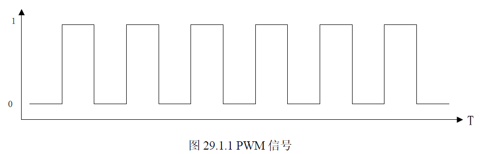

# PWM (Pulse Width Modulation)

## 一、IMX6ULL PWM简介
> 1. IMX6ULL 的 PWM是 16位计数器。
> 2. 有4个 16位的FIFO。
> 3. 一个12位的分频器。
> 4. 正点原子LCD屏幕的背光IO 连接到了 GPIO_IO08上，GPIO_IO8 可以复位PWM1_OUT信号。
> 5. PWM 计数器从0x0000 开始计数，当计数器的值等于PWMPR + 1 的时候定时器就会开始下一个周期的运行，因此PWMPR寄存器控制着PWM频率。
> 6. FIFO 保存采样值，当我们向 PWMSAR 寄存器写采样值的会写到 FIFO 中，当读取一次 PWMSR 寄存器 FIFO 里面的数据都会减一，或者每产生一个周期的 FIFO 数据也会减一。直到 FIFO 为空就无法产生PWM信号。我们可以在中断向 FIFO 入采样数据，也就是向 PWMSAR 写数据。
> PWMCR寄存器，bit[0] 是PWM的使能信号，bit[2:1]设置位0，每个周期使用FIFO中的一个数据，bit[15:4] 是分频器的值。可以设置0~4095。对应1~4096个分频。bit[17:16] 是设置PWM 的时钟源，设置位1，表示使用ipg_clk = 66MHz。bit[19:18] 是设置PWM 的输出方式，设置位0。bit[27:26]，设置为01，当FIFO里面空余位置大于2的时候FIFO为空，就会引发中断。
> PWMIR寄存器，bit[0]设置为1，开启FIFO空中断。