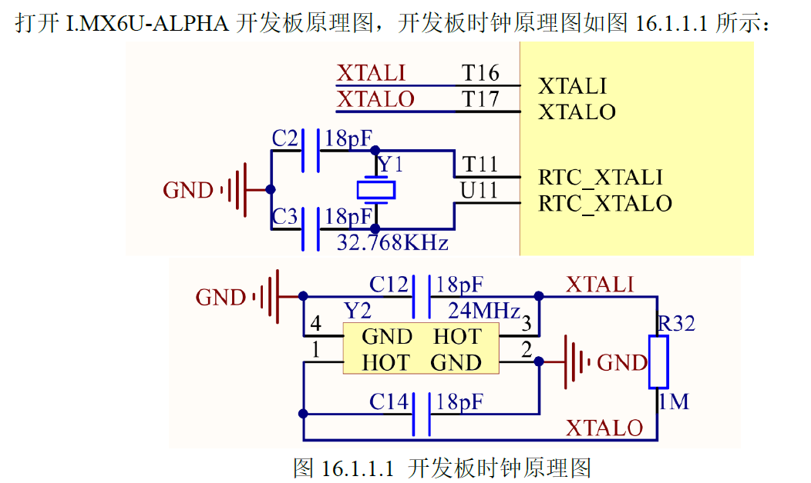
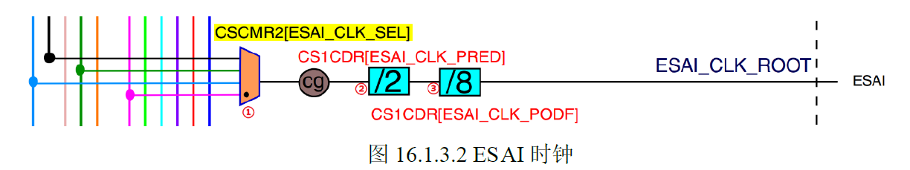
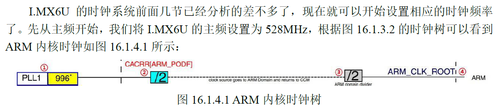
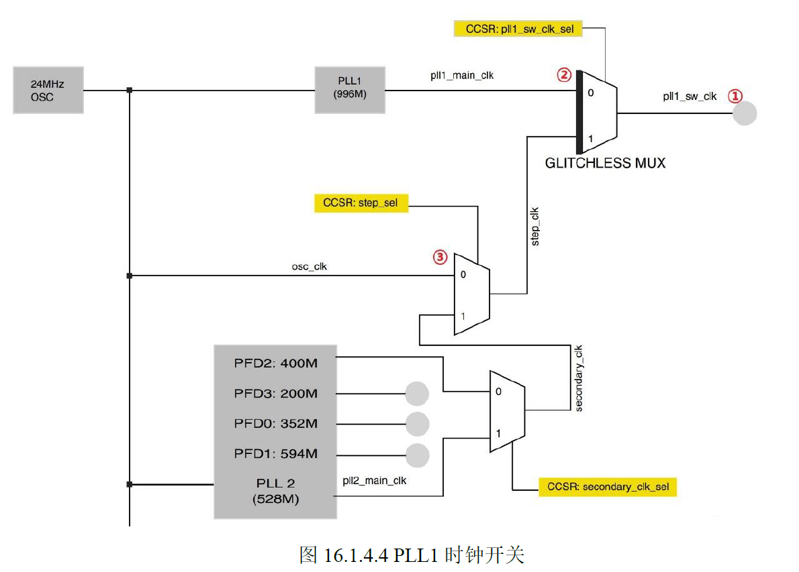
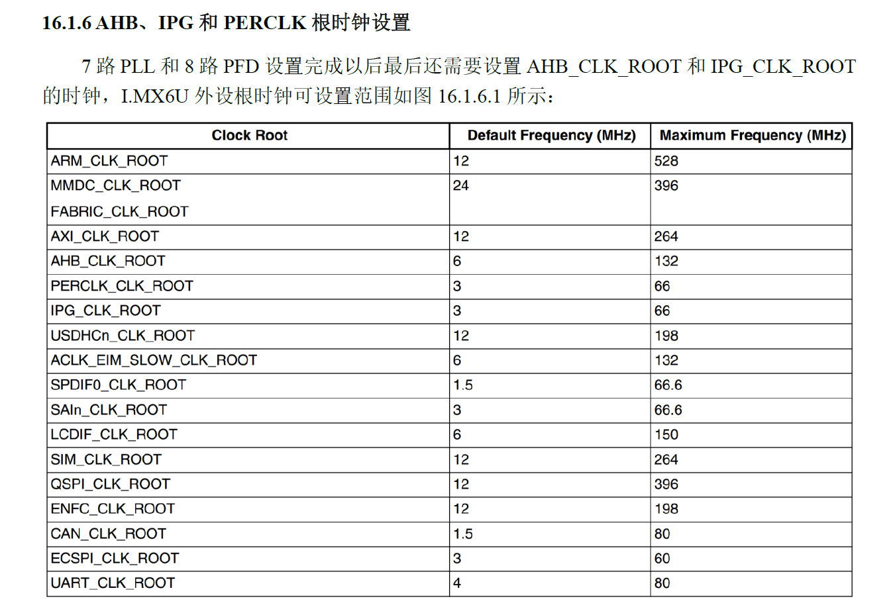
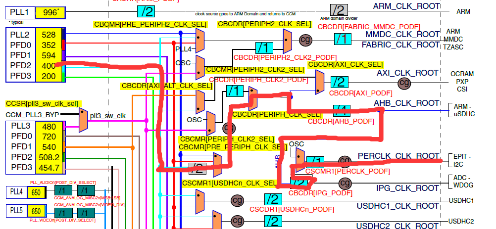

# 时钟树clock tree

## imx6ull时钟树clock tree

### 一、 硬件原理图分析
> 1. 32.768kHz的晶振，作为时钟树的根节点。给RTC（实时时钟）使用。
> 2. 在6ull的T16 和 T17 这2个IO上接了一个24MHz的晶振，作为时钟树的根节点。

### 二、IMX6ULL时钟树分析
#### 1、从24MHz晶振生成7路PLL 又从7路PLL生成PFD
> 1. PLL1 also reference as ARM PLL
> 2. PLL2 also reference as System PLL 582MHz 分出4路PFD PLL2_FPD0~3
> 3. PLL3 also reference as USB1 PLL  480MHz 分出4路PFD PLL3_FPD0~3
> 4. PLL4 also reference as Audio PLL 主供音频使用
> 5. PLL5 also reference as video PLL 主供视频使用 如 RGB LCD 图像处理有关的外设
> 6. PLL6 also reference as ENET PLL 主供以太网使用 
> 7. PLL7 also reference as USB2 PLL

### 3、时钟树分析

### 4、如何选择合适的时钟
> 比如 ESAI 寄存器  需要选择 PLL4、PLL3_PFD2、PLL5、PLL3

### 5、例如要初始化的 PLL 和 FDP
> PLL1
> PLL2 和 PLL2_FPD0~3
> PLL3 和 PLL3_FPD0~3
> 一般按照时钟树的图来设置，确保时钟的正确性。

## 三、IMX6ULL 内核 时钟设置

### 1、系统主频的配置
> 1. 要设置ARM内核主频为582MHz，设置CACRR寄存器的ARM_PODF为2分频。然后设置PLL1 = 1056MHz即可。CACRR的bit3-0 为ARM_PODF位，可设置为0-7，分别对应1、2、3、4、5、6、7分频。
>2. 设置PLL1 = 1056MHz。PLL1 = pll1_sw_clk_sel。pll1_sw_slk有2路可以选择，分别是pll1_main_clk和step_clk。通过CCSR寄存器的bit2来选择。为0时选择pll1_main_clk，为1时选择step_clk。
> 
> 3. 在修改PLL1时，也就是设置系统时钟的时候需要给6ULL一个零时时钟，也就是step_clk。在修改PLL1时需要将pll1_sw_clk切换到step_clk上。
> 4. 设置step_clk也有2路来源，分别是由osc_clk和secondary_clk组成。由CCSR的step_sel位（bit8）来设置。为0时选择osc_clk=24MHz晶振，为1时选择secondary_clk。
> 5. 时钟切换成功后，就可以修改PLL1的频率了。
> 6. 通过CCM_ANALOG_PLL_ARM寄存器的DIV_SELECT位（bit0-6）来设置PLL1的频率。
>>    ####  PLL 频率计算公式推导
>> **1. 基础公式：**
>> $$ f_{out} = f_{ref} \times \frac{DIV\_SELECT}{2} $$
>> **2. 代入已知数值：**
>> $$ 1056\text{ MHz} = 24\text{ MHz} \times \frac{DIV\_SELECT}{2} $$
>> **3. 求解计算：**
>> $$ \frac{DIV\_SELECT}{2} = \frac{1056}{24} = 44 $$
>> $$ DIV\_SELECT = 44 \times 2 = 88 $$
>> **✅ 最终结果：** `DIV_SELECT = 88`
> 7. 还要设置CCM_ANALOG_PLL_ARM寄存器的ENABLE位（bit13）为1，才能使PLL1生效。
> 8. 在切换回PLL之前，设置CACCR的寄存器的ARM_PODF = 1。

### 2、各个PLL时钟的配置
>  #### PLL2 和 PLL3。PLL2 固定528MHz，PLL3 固定480MHz。
> 1. 初始化 PLL2_PFD0~3。寄存器 `CCM_ANALOG_PFD_528n` 用于设置 4 路 PFD 的时钟频率，其计算公式为：$f_{PFD} = 528\text{ MHz} \times \frac{18}{PFD\_FRAC}$。例如将 PLL2_PFD0 设置为 352 MHz，即 $352\text{ MHz} = 528\text{ MHz} \times \frac{18}{PFD0\_FRAC}$，通过公式反推计算得出 $PFD0\_FRAC = \frac{528 \times 18}{352} = 27$，因此只需将寄存器中的 `PFD0_FRAC` 字段设置为 27 即可。

### 3、其他外设时钟源配置
> #### AHB_CLK_ROOT、PERCLK_CLK_ROOT以及IPG_CLK_ROOT
> 因为PERCLK_CLK_ROOT 和 IPG_CLK_ROOT 要用到AHB_CLK_ROOT,所以我们要初始化AHB_CLK_ROOT。

> 1. 初始化 AHB_CLK_ROOT。
    >-  AHB_CLK_ROOT = 132MHz
    >-  设置CBCMR寄存器的PRE_PERIPH_CLK_SEL位，设置CBCDR寄存器的PERIPH_CLK_SEL位0。设置CBCDR寄存器的AHB_PODF位为2（3分频,396MHz）
    PERCLK_CLK_ROOT = IPG_CLK_ROOT = 66MHz
>2. 初始化 IPG_CLK_ROOT。
    >-  设置CBCDR寄存器IPG_PODF位为1（2分频,132/2 = 66MHz）。
>3. 初始化 PERCLK_CLK_ROOT。
    >-  设置CBCDR寄存器PERCLK_CLK_SEL位为0，选择时钟源为IPG_CLK_ROOT。