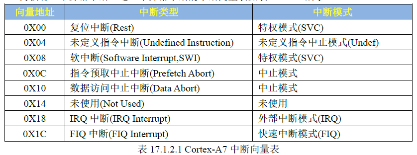
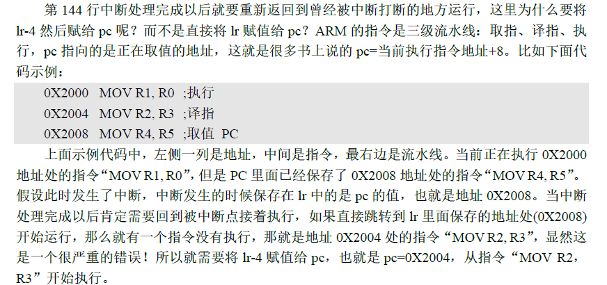
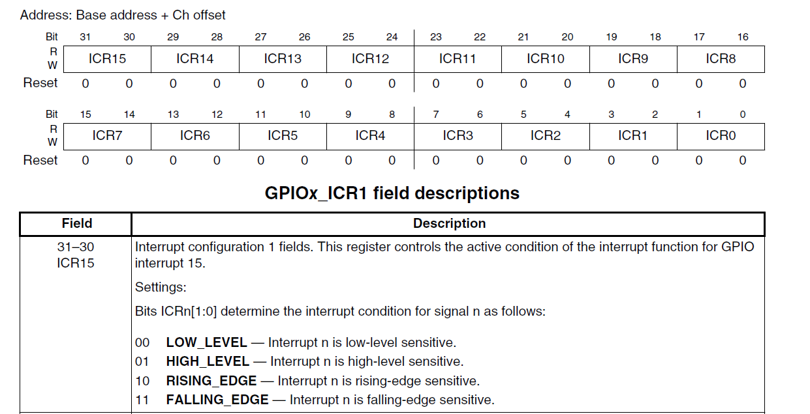
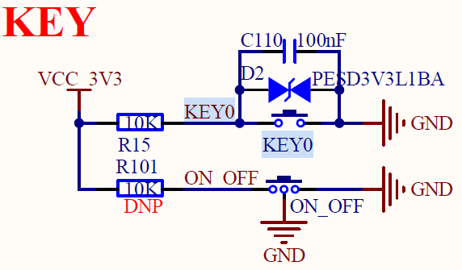
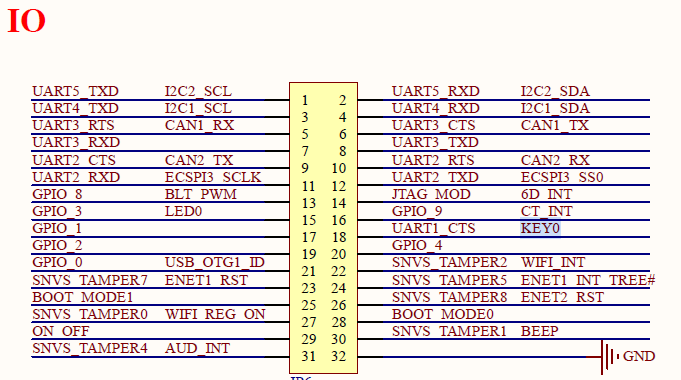

# 中断
## 一、回顾 STM32 中断 内核：Cortex-M
> STM32的中断系统主要有以下 几个关键点：
> 1. 中断向量表。
> 2. NVIC(内嵌向量中断控制器 )。
> 3. 中断使能。
> 4. 中断服务函数。
### 1. 中断向量表
> ARM 芯片从 0x00000000 开始运行，执行指令。在程序开始的地方存放着中断向量表。中断向量表主要功能是描述中断对应的中断服务函数
对于STM32来说，代码最开始的地址存放堆栈栈顶指针。
### 2. 中断向量偏移
> 一般 ARM 从 0x00000000 地址开始运行，对于STM32 我们设置连接首地址为 0x80000000。
    如果代码一定要从 0x80000000 地址开始运行，我们需要告诉 soc 内核，也就是设置中断向量表的偏移量为 0x80000000。设置SCB的 VTOR 寄存器为新的中断向量表起始地址即可。
    ```c
    void SystemInit (void)
    {
        RCC->CR |= (uint32_t)0x00000001;
        /* 省略其它代码 */
    #ifdef VECT_TAB_SRAM
        SCB->VTOR = SRAM_BASE | VECT_TAB_OFFSET;
    #else
        SCB->VTOR = FLASH_BASE | VECT_TAB_OFFSET;
    #endif
    }

### 3. NVIC 中断控制器
> NVIC 就是中断管理机构，使能和关闭中断、设置中断优先级。
### 4. 中断服务函数编写
> 1.中断服务函数的编写需要注意以下几点：
> 2.无参无返：函数必须定义为 void Func(void)，且名称需与启动文件中的一致。
> 3.快进快出：严禁使用 Delay 延时或死循环，只做标志位设置或数据读取。
> 4.Volatile ：中断中修改的全局变量，必须加 volatile 关键字。
> 5.清除标志：处理完逻辑后，必须清除硬件中断标志位，防止重复进入。
> 6.避免打印：尽量不要在中断里使用 printf，会严重拖慢系统速度。


## 二、Cortex-A7 中断系统
### 1. Cortex-A 中断向量表（vector tables）
> Cortex-A 中断向量表有8个中断，其中重点关注IRQ。Cortex-A 的中断向量表需要用户自己去定义。

### 2. 中断向量偏移
> 我们的裸机例程都是从 0x8700000 开始执行的，因此要设置中断向量偏移。
### 3. GIC(Generic Interrupt Controller, 通用中断控制器)
> 同 NVIC 一样，GIC 用于管理Cortex-A 中断。GIC 提供了开关中断，设置中断优先级等功能。
### 4. IMX6Ull 中断号
> 为了区分不同的中断，引入了中断号。ID0~15 是给 SGI ，ID16~31是给 PPI ，剩下的 ID32~1019 是给SPI的
### 5. 中断函数编写
> 一个是 IRQ 中断服务函数（汇编）的编写，另一个是在 IRQ 中断服务函数里面去查找幷运行的具体的外设中断服务函数。

## 三、GIC 中断控制器
> GIC 中断控制器是 Cortex-A7 中的中断控制器，用于管理中断。GIC 提供了开关中断，设置中断优先级等功能。
GIC_EnableIRQ(GPT1_IRQn中断号);初始化 GIC 中断控制器。

### 中断配置流程
> 1. 初始化 GIC 中断控制器。
> 2. 注册中断号。
> 3. 编写中断处理函数，必须清除中断标志位。
> 4. 使能中断。

## 四、中断实验编写
> 1. 编写按键中断例程。
>- KEY0使用 UART1_CTS 这个IO。编写 UART1_CTS 的中断代码。
> 2. 修改start.S
>+ 添加中断向量表，编写复位中断服务函数和IRQ中断服务函数。
编写复位中断函数，内容如下：
    1.关闭I,D Cache 和 MMU
    2. 设置处理器9种工作模式下对应的SP指针。要使用中断那么必须设置IRQ模式下的SP指针。索性直接设置所用模式下的SP指针
    3. 清除bss段
    4. 跳转到main函数
> 3. CP15 协处理器
MCR: 将 CP15 协处理器种的寄存器数据到 ARM 寄存器中。
MRC 就是读取 CP15 寄存器，MRC 就是写 CP15 寄存器，MCR 指令格式如下：
MCR{cond} p15，<cpc1>,<Rt>,<CRm>,<opc2>
MRC p15,0,r0,c0,c0,0
现在要关闭I，D，Cache 和 MMU， 打开Cortex-A7 参考手册到105页，找到 SCTLR 寄存器。也就是系统控制寄存器，此寄存器bit0 用于打开和关闭MMU，bit1 对其控制位，bit2 控制 D Cache的打开和关闭。bit11 用于控制分支预测，bit12用于控制I Cache。
> 4. 中断向量偏移设置
将新中断向量表首地址写入到cp15 协处理器的 VBAR 寄存器
MCR{cond} p15,<opc1>,<Rt>,<CRn>,<CRm>,<opc2>
MRC p15,0, r0, c12, c0, 0
MCR p15,0, r0, c12, c0, 0
> 5. IRQ中断服务函数
mrc p15, 4, r1, c15, c0, 0 读取CP15的 CBAR 寄存器。CBAR寄存器保存了 GIC 控制器的中断向量表首地址。GIC 寄存器组的偏移地址 0x1000~0x1FFF 为 GIC 的分发器。0x2000~0x3FFF 为 CPU 的接口端。
代码中，R1 寄存器把保存着 GIC 控制器的 CPU 接口端基地址，读取 CPU 接口端的 GICC_IAR 寄存器的值保存到 R0 寄存器中。可以从GICC_IAR bit[9:0]寄存器中获取到当前中断的中断号(ID),读取中断 ID 的目的是为了得到对应的中断处理函数。
system_irqhandler 就是具体中断处理函数，此函数根据中断 ID 来判断是哪个中断，然后调用对应的中断处理函数。此函数有一个参数， GICC_IAR 中的值，就是中断ID。
system_irqhandler 处理完具体的中断以后，要清除中断标志位，防止重复进入，读取GICC_IAR寄存器对应的中断 ID 的值写入到 GICC_EOIR 寄存器里。


## IMX6ULL GPIO中断设置
> 1. 我们首先要设置GPIO 的中断触发方式。也就是 GPIO_ICR1 或 GPIO_ICR2 寄存器。触发方式有低电平（00）、高电平（01）、上升沿（10）、下降沿（11）触发。


本例设置 KEY0 ，设置 KEY0 ，也就是 UART1_CTS 这个IO。为下降沿触发。

> 2. 使能 GPIO 对应的中断，设置 GPIO_IMR 寄存器。
> 3. 处理完中断以后，需要清除中断标志位，也就是清除 GPIO_ISR 寄存器。GPIO_ISR 寄存器是写 1 清除。

## GIC 中断控制器配置
> 1. 使能相应中断 ID ， GPIO_IO18 对应的中断 ID 位 67+32 = 99。
> 2. 设置中断优先级，GICD_IPRIORITYR 寄存器。
> 3. 注册GPIO_IO18 中断处理函数。
> 4. 处理完中断以后，清除中断标志位，写入 GICC_EOIR 寄存器。